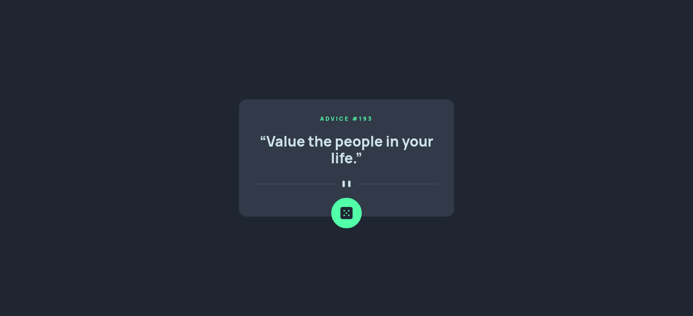

# Frontend Mentor - Advice generator app

This is a solution to the [Advice generator app challenge on Frontend Mentor](https://www.frontendmentor.io/challenges/advice-generator-app-QdUG-13db). Frontend Mentor challenges help you improve your coding skills by building realistic projects.

## Table of contents

- [Frontend Mentor - Advice generator app](#frontend-mentor---advice-generator-app)
  - [Table of contents](#table-of-contents)
  - [Overview](#overview)
    - [The challenge](#the-challenge)
    - [Screenshot](#screenshot)
    - [Links](#links)
  - [My process](#my-process)
    - [Built with](#built-with)
  - [Author](#author)

## Overview

### The challenge

Users should be able to:

- View the optimal layout for the app depending on their device's screen size
- See hover states for all interactive elements on the page
- Generate a new piece of advice by clicking the dice icon

### Screenshot

### Links

- Solution URL: [Solution](https://gitlab.com/bit-01/advice-generator-app)
- Live Site URL: [Live Site](https://bit-01.gitlab.io/advice-generator-app)

## My process

### Built with

- Semantic HTML5 markup
- CSS custom properties
- Flexbox
- [Vue 3](https://vuejs.org/) - JS Framework
- [Axios](https://axios-http.com) - Promise based HTTP Client
- Mobile-first workflow

## Author

- Website - [Bassel Aflak](https://bit01.rf.gd)
- Frontend Mentor - [@bit-01](https://www.frontendmentor.io/profile/bibt-01)
- Gitlab - [@bit-01](https://gitlab.com/bit-01)
- Instagram - [@bit_01](https://instagram.com/bit_01)
- Codepen - [@bit-01](https://codepen.io/bit-01)
